# Hi there, I'm Paavo Reinikka 👋

### Data Analyst | Data & AI Engineering

I am a data professional specializing in the integration of **Large Language Models (LLMs)** with traditional data workflows. My expertise focuses on **Retrieval-Augmented Generation (RAG)**, **Knowledge Extraction**, and building applications with **OpenAI & OpenAI-compatible APIs**. I also have some experience with local models (e.g., using **Ollama**), and a reasonable grasp of model architectures and **Pytorch.**

---

### 🚀 What I'm working on
- 🔭 **Current Focus:** Building hybrid RAG systems and LLM-powered software engineering utilities.
- 🌱 **Learning:** Advanced Data Engineering pipelines and AI infrastructure.
- 💬 **Ask me about:** Python, RAG, Data Wrangling, or how to load your books into a database!

---

### 🛠️ Tech Stack & Skills
- **Languages:**     
- **Data & AI:**    **RAG**, **Knowledge Extraction**, **LLM Integration**.
- **Database & Tools:**   
- **Deployment:**  

---

### 📂 Projects I worked on recently
- **[QueryBooks](https://github.com/PaavoReinikka/QueryBooks):** Application for loading books into a PostgreSQL database and querying them using LLMs/RAG.
- **[KnowledgeExtraction](https://github.com/PaavoReinikka/KnowledgeExtraction):** A set of utilities designed for hybrid RAG systems.
- **[SEwithLLMs](https://github.com/PaavoReinikka/SEwithLLMs):** Dedicated to demos and experiments involving Software Engineering with LLMs.
- **[BranchAndBound](https://github.com/PaavoReinikka/BranchAndBound):** Core for BnB algorithm written in Rust, and some applications using it (ML related, with Python interfaces).

---

### 📫 Connect with me
- [LinkedIn](https://www.linkedin.com/in/reinikka-paavo-553a4316a/)
- [Portfolio Site (Netlify)](https://paavo-reinikka.netlify.app/)
- [Portfolio Site (Deno)](https://paavo-portfolio.deno.dev/)

---

  
  <!--  -->

